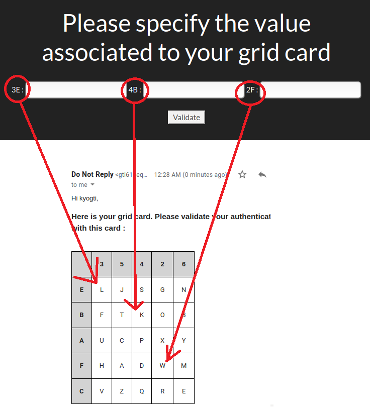
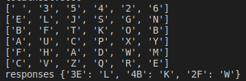

# Run config step by step : 

## Configure virtual-env

### Create virtuial-env
```bash
python3 -m venv venv
```

### activate virtual-env
```bash
source venv/bin/activate
```

## Install prerequisites

### Install pip3
```bash
sudo apt install python3-pip
```

### Install required packages
```bash
pip install -r requirements.txt
```

## Run
```bash
python3 GTI619/manage.py runserver
```

# Accès au site web
Vous pouvez vous connecter ici : 
http://localhost:8000/Lab5/login/


## Double authentification
Une fois la connection avec la combinaison `username/password`, vous recevrez un courriel avec un `Grid card` pour confirmer votre identité.



Si vous n'avez pas entré une vraie adresse courriel, vous pouvez consulter la combinaison dans le terminal : 



## Rôle et utilisateur
Il y a trois types de rôles pour notre application : 
Administrateur (Admin), Préposé aux clients d'affaire (CA) et Préposé aux clients résidentiels (CR)
|Rôle|username|password|Accès|
|-|-|-|-|
|Admin|admin|gti619|params, CA, CR, signup|
|Admin|< autres utilisateurs en tant qu'admin >|< son mdp >|CA, CR|
|CA|User1|gti619user1|CA|
|CR|User2|gti619user2|CR|
